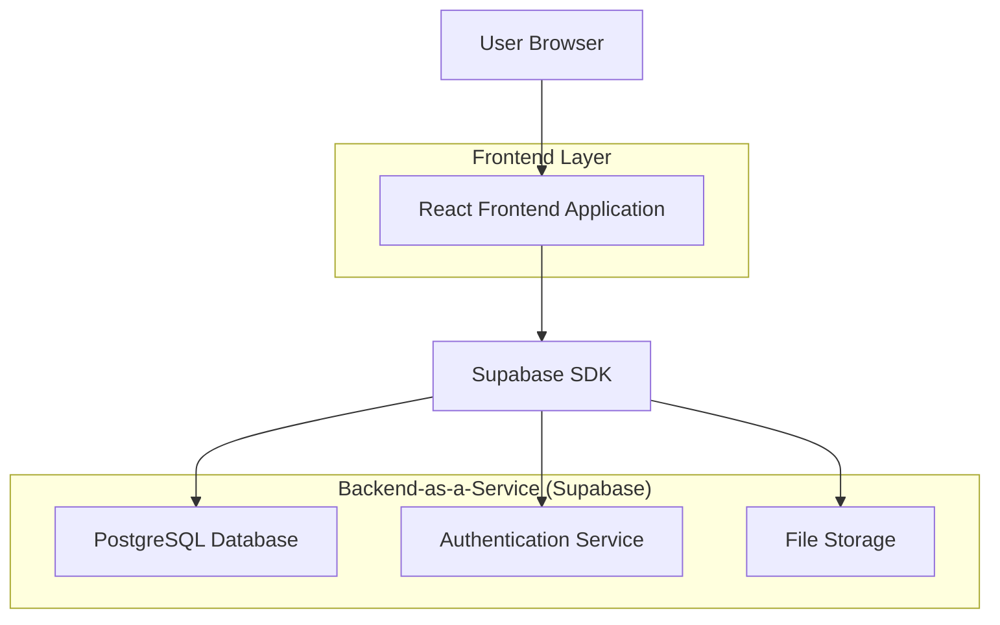
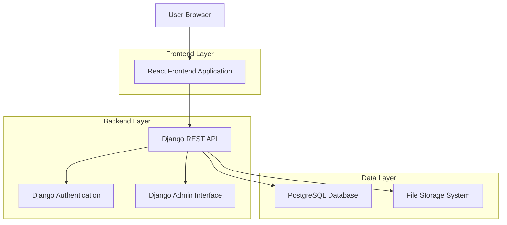
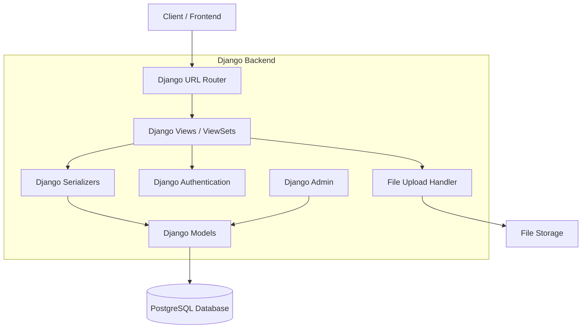

# Django + PostgreSQL Migration Architecture Document

## 1. Architecture Design

### Current Architecture (React + Supabase)


### New Architecture (React + Django + PostgreSQL)


## 2. Technology Description

### Current Stack
- Frontend: React@18 + TypeScript + Vite + TailwindCSS + Radix UI
- Backend: Supabase (PostgreSQL + Auth + Storage + Real-time)
- Authentication: Supabase Auth
- File Storage: Supabase Storage
- State Management: React Query (@tanstack/react-query)

### New Stack
- Frontend: React@18 + TypeScript + Vite + TailwindCSS + Radix UI (unchanged)
- Backend: Django@5.0 + Django REST Framework@3.14
- Database: PostgreSQL@15
- Authentication: Django Authentication + JWT
- File Storage: Django + Local/Cloud Storage
- Admin Interface: Django Admin
- API Documentation: Django REST Framework Browsable API

## 3. Current System Analysis

### 3.1 Frontend Components
- **Pages**: Home, Admin Dashboard, Events Manager, Board Members, Job Applications
- **Authentication**: useAuth hook with Supabase integration
- **State Management**: React Query for server state, React hooks for local state
- **UI Components**: Radix UI components with custom styling
- **File Upload**: Direct to Supabase storage with progress tracking

### 3.2 Database Schema (Current Supabase)
Key tables identified:
- `user_roles` - User role management
- `events` - School events with publishing status
- `news_posts` - News articles with comments and likes
- `board_members` - Board member information
- `job_applications` - Job application submissions
- `academic_programs` - Academic program details
- `admission_forms` - Student admission forms
- `gallery_photos` - Photo gallery management
- `contact_submissions` - Contact form submissions
- `hero_slides` - Homepage hero slider content

### 3.3 Authentication System
- Supabase Auth with email/password
- Role-based access control (admin/user)
- Session management with localStorage
- Admin role verification for protected routes

### 3.4 File Storage
- Supabase Storage buckets:
  - `gallery-images` - Event and gallery photos
  - `cv-files` - Job application CVs
  - `hero-images` - Homepage slider images

## 4. Route Definitions

### Frontend Routes (Unchanged)
| Route | Purpose |
|-------|----------|
| / | Home page with hero slider and latest news |
| /admin | Admin dashboard with management tools |
| /admin/events | Events management interface |
| /admin/board-members | Board members management |
| /admin/job-applications | Job applications review |
| /news | News articles listing |
| /news/:slug | Individual news article view |
| /contact | Contact form and information |
| /admissions | Admission forms and information |
| /academic-programs | Academic programs listing |
| /gallery | Photo gallery |

## 5. API Definitions (New Django Backend)

### 5.1 Authentication APIs

**User Login**
```
POST /api/auth/login/
```
Request:
| Param Name | Param Type | isRequired | Description |
|------------|------------|------------|-------------|
| email | string | true | User email address |
| password | string | true | User password |

Response:
| Param Name | Param Type | Description |
|------------|------------|-------------|
| access_token | string | JWT access token |
| refresh_token | string | JWT refresh token |
| user | object | User information |

**User Registration**
```
POST /api/auth/register/
```

**Token Refresh**
```
POST /api/auth/refresh/
```

### 5.2 Events APIs

**List Events**
```
GET /api/events/
```

**Create Event**
```
POST /api/events/
```

**Update Event**
```
PUT /api/events/{id}/
```

**Delete Event**
```
DELETE /api/events/{id}/
```

### 5.3 File Upload APIs

**Upload File**
```
POST /api/upload/
```

## 6. Server Architecture Diagram



## 7. Data Model Migration

### 7.1 Django Models Structure

```python
# models.py
from django.db import models
from django.contrib.auth.models import AbstractUser

class User(AbstractUser):
    email = models.EmailField(unique=True)
    created_at = models.DateTimeField(auto_now_add=True)
    updated_at = models.DateTimeField(auto_now=True)

class UserRole(models.Model):
    user = models.ForeignKey(User, on_delete=models.CASCADE)
    role = models.CharField(max_length=50)
    created_at = models.DateTimeField(auto_now_add=True)

class Event(models.Model):
    id = models.UUIDField(primary_key=True, default=uuid.uuid4)
    title = models.CharField(max_length=255)
    description = models.TextField()
    event_date = models.DateTimeField()
    location = models.CharField(max_length=255, blank=True)
    is_featured = models.BooleanField(default=False)
    is_published = models.BooleanField(default=True)
    image_url = models.URLField(blank=True)
    created_at = models.DateTimeField(auto_now_add=True)
    updated_at = models.DateTimeField(auto_now=True)
```

### 7.2 Database Schema Mapping

| Supabase Table | Django Model | Key Changes |
|----------------|--------------|-------------|
| user_roles | UserRole | Foreign key to Django User |
| events | Event | UUID primary key preserved |
| news_posts | NewsPost | Slug field for SEO |
| board_members | BoardMember | Social links as JSON field |
| job_applications | JobApplication | File upload path handling |
| academic_programs | AcademicProgram | Array fields as JSON |
| admission_forms | AdmissionForm | Form type choices |
| gallery_photos | GalleryPhoto | Category choices |
| contact_submissions | ContactSubmission | Status choices |
| hero_slides | HeroSlide | Image upload handling |

## 8. Migration Strategy (Zero Downtime)

### Phase 1: Preparation (Week 1)
1. **Django Backend Development**
   - Set up Django project with PostgreSQL
   - Create all Django models matching Supabase schema
   - Implement Django REST API endpoints
   - Set up Django Admin interface
   - Configure authentication system

2. **Data Export from Supabase**
   - Export all table data to JSON/CSV
   - Download all files from Supabase storage
   - Create data migration scripts

### Phase 2: Parallel Development (Week 2)
1. **Django Backend Completion**
   - Implement all API endpoints
   - Add comprehensive testing
   - Set up file upload handling
   - Configure CORS for React frontend

2. **Frontend API Integration**
   - Create new API service layer
   - Update React hooks to use Django APIs
   - Implement new authentication flow
   - Test all functionality

### Phase 3: Data Migration (Week 3)
1. **Database Setup**
   - Set up production PostgreSQL database
   - Run Django migrations
   - Import data from Supabase export
   - Verify data integrity

2. **File Migration**
   - Upload files to new storage system
   - Update file URLs in database
   - Test file access and uploads

### Phase 4: Deployment (Week 4)
1. **Backend Deployment**
   - Deploy Django backend to production
   - Configure production settings
   - Set up monitoring and logging

2. **Frontend Update**
   - Update API endpoints in React app
   - Deploy updated frontend
   - Monitor for issues

3. **Supabase Decommission**
   - Backup final state
   - Gradually reduce Supabase usage
   - Complete migration

## 9. Testing and Rollback Procedures

### 9.1 Testing Strategy
1. **Unit Tests**
   - Django model tests
   - API endpoint tests
   - Authentication tests

2. **Integration Tests**
   - Frontend-backend integration
   - File upload/download tests
   - Admin interface tests

3. **User Acceptance Testing**
   - All user workflows
   - Admin functionality
   - Performance testing

### 9.2 Rollback Plan
1. **Immediate Rollback** (if critical issues)
   - Revert frontend to Supabase APIs
   - Keep Supabase running during transition
   - Switch DNS/routing back

2. **Data Rollback**
   - Restore from Supabase backup
   - Re-sync any new data
   - Verify data consistency

## 10. Django Admin Interface Setup

### 10.1 Admin Configuration
```python
# admin.py
from django.contrib import admin
from .models import Event, NewsPost, BoardMember

@admin.register(Event)
class EventAdmin(admin.ModelAdmin):
    list_display = ['title', 'event_date', 'is_published', 'is_featured']
    list_filter = ['is_published', 'is_featured', 'event_date']
    search_fields = ['title', 'description']
    date_hierarchy = 'event_date'
    ordering = ['-event_date']
```

### 10.2 Admin Features
- **Table Management**: Full CRUD operations on all tables
- **User Management**: User roles and permissions
- **Content Management**: Events, news, gallery photos
- **Application Review**: Job applications, admissions
- **System Monitoring**: Logs, analytics, performance

### 10.3 Admin Access
- URL: `/admin/`
- Authentication: Django superuser accounts
- Permissions: Role-based access control
- Interface: Django's built-in admin with custom styling

## 11. Benefits of Migration

### 11.1 Technical Benefits
- **Full Control**: Complete control over backend logic
- **Customization**: Unlimited customization possibilities
- **Performance**: Optimized queries and caching
- **Scalability**: Better horizontal scaling options

### 11.2 Administrative Benefits
- **Direct Database Access**: Full SQL access to data
- **Advanced Admin Interface**: Rich admin panel with Django Admin
- **Better Debugging**: Comprehensive logging and debugging tools
- **Cost Control**: Predictable hosting costs

### 11.3 Development Benefits
- **Familiar Technology**: Django is well-documented and widely used
- **Rich Ecosystem**: Extensive package ecosystem
- **Better Testing**: Comprehensive testing framework
- **API Documentation**: Auto-generated API documentation

## 12. Implementation Timeline

| Week | Phase | Tasks | Deliverables |
|------|-------|-------|-------------|
| 1 | Setup | Django project, models, basic APIs | Working Django backend |
| 2 | Development | Complete APIs, admin interface, testing | Full backend functionality |
| 3 | Integration | Frontend updates, data migration | Integrated system |
| 4 | Deployment | Production deployment, monitoring | Live Django system |

## 13. Risk Mitigation

### 13.1 Technical Risks
- **Data Loss**: Multiple backups and staged migration
- **Downtime**: Parallel systems and gradual cutover
- **Performance**: Load testing and optimization
- **Security**: Security audit and penetration testing

### 13.2 Business Risks
- **User Disruption**: Minimal UI changes, same functionality
- **Training**: Admin interface training for staff
- **Support**: Comprehensive documentation and support plan

This migration will provide a robust, scalable, and fully controllable backend system while preserving all existing functionality and providing enhanced administrative capabilities.